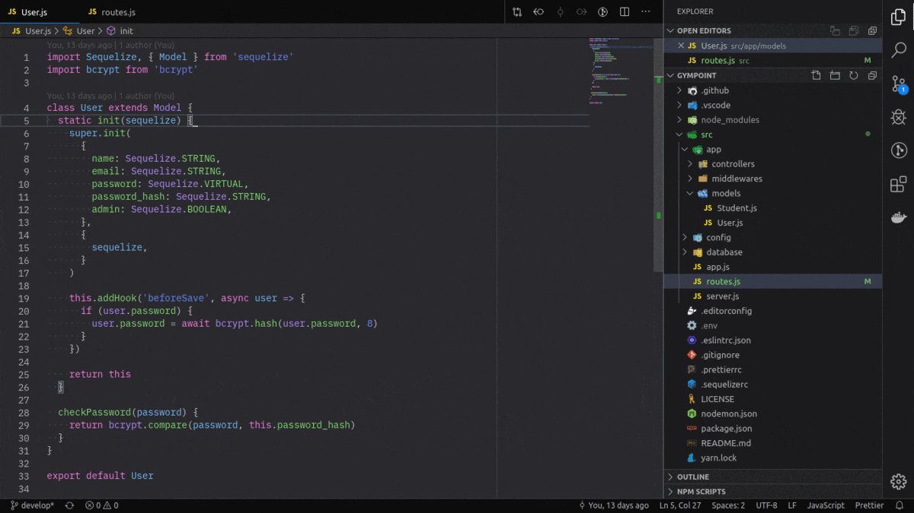

<h1 align="center">
    Firefox Theme for VS Code
</h1>

 

    

 

    
    
    
    

<h2 align="center">
    A VS Code theme based on Mozilla Firefox' developer tools
</h2>

 

## Preview

  

<h2 align="center">
    Enjoy 🎉
</h2>
